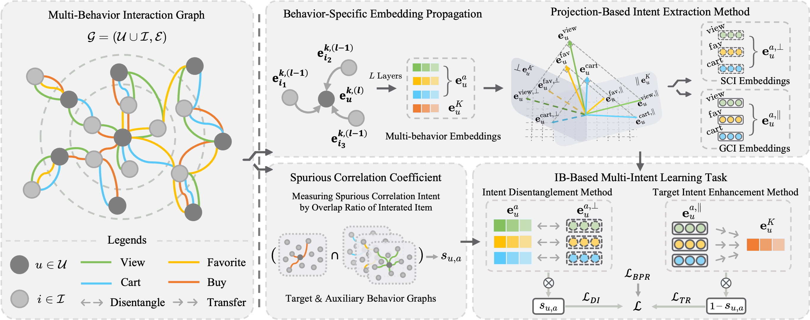

# MBID

This repository contains source codes and datasets for our **CIKM'25** paper:

- Multi-Behavior Intent Disentanglement for Recommendation via Information Bottleneck Principle

**Note:** Extended version accepted by *[Neurocomputing](https://doi.org/10.1016/j.neucom.2025.131454)*.

## Framework



The overall architecture of MBID from the **extended journal version**. i) Behavior-specific embedding propagation learns multi-behavior embeddings, and projection-based intent extraction method decomposes auxiliary behavior embeddings into both SCI and GCI embeddings. ii) The spurious correlation coefficient quantifies the spurious correlation intents between behaviors. iii) IB-based multi-intent learning personally disentangles spurious correlation intents and transfers genuine ones from auxiliary into the target behavior.

## Usage
### Train & Test

- Training MBID on IJCAI15:
```shell
python main.py --dataset=IJCAI_15
```

- Training MBID on Tmall:
```shell
python main.py --dataset=Tmall
```

- Training MBID on Retail:
```shell
python main.py --dataset=retailrocket
```

- Testing MBID using a saved model file:
```shell
ipython evaluation.ipynb
```

## Citation

If you find this work useful, please cite our papers:

### Conference Version (CIKM'25)

```bibtex
@inproceedings{MBID,
    title = {Multi-Behavior Intent Disentanglement for Recommendation via Information Bottleneck Principle},
    author = {Xu, Tongxin and Bin, Chenzhong and Xiao, Cihan and Li, Yunhui and Gu, Tianlong},
    booktitle = {Proceedings of the 34th ACM International Conference on Information and Knowledge Management},
    year = {2025}
}
```

### Extended Journal Version (Neurocomputing)

```bibtex
@article{MBID_Ext,
    title = {User Intent Disentanglement for Multi-Behavior Recommendation via Information Bottleneck Principle},
    author = {Bin, Chenzhong and Xu, Tongxin and Zhang, Feng},
    journal = {Neurocomputing},
    volume = {656},
    pages = {131454},
    year = {2025},
}
```
